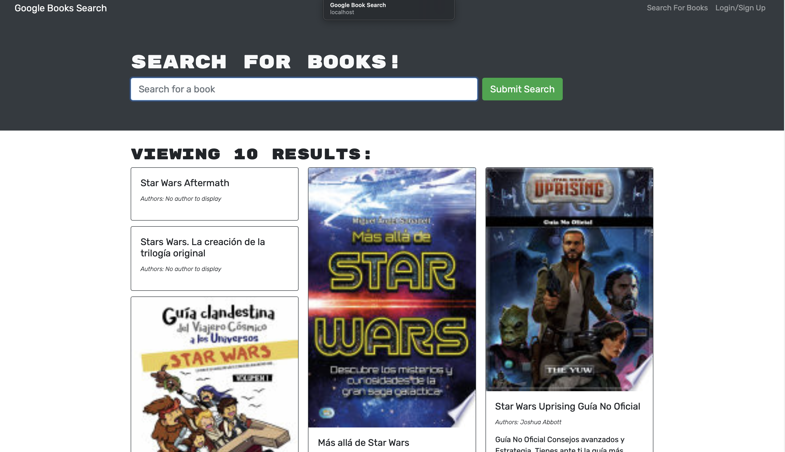

# book-search-engine

## Desctiption
This application is designed to allow the user to create an account and add/delete books from their account using the google book search api. This application is not currenlty working, returning a 'Cannot read property 'some' of undefined'.

## Installation
This application is still in the debugging phase and thus there is not yet a fully functioning version of this applicaion at the moment.
## Photos

## Usage
In theory, once you have the application loaded into your browser you would be able
to create an account or login. After doing so, you would be able to use the built in search engine to find books to add to your account - you would also be able to delete those books from your account.

